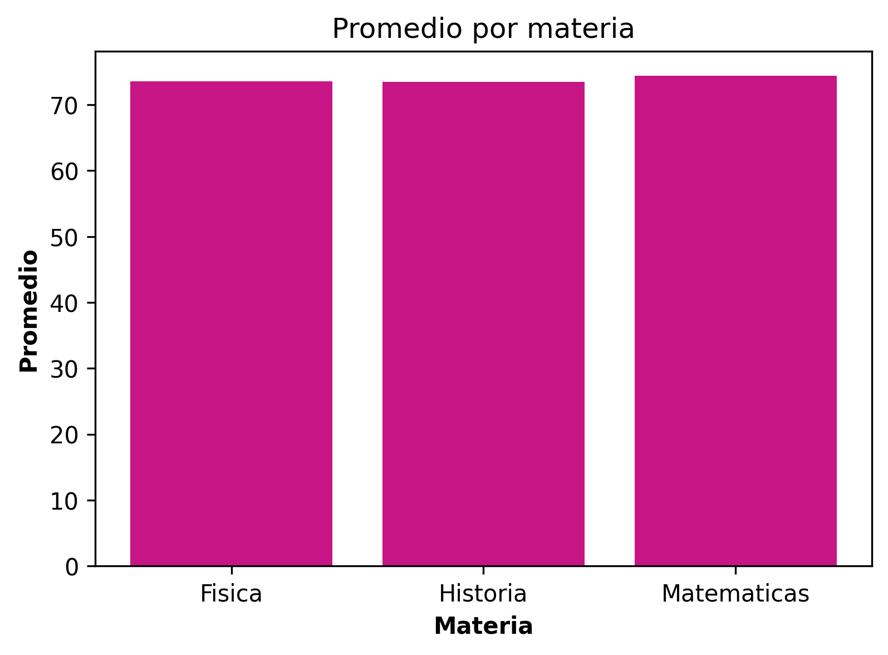
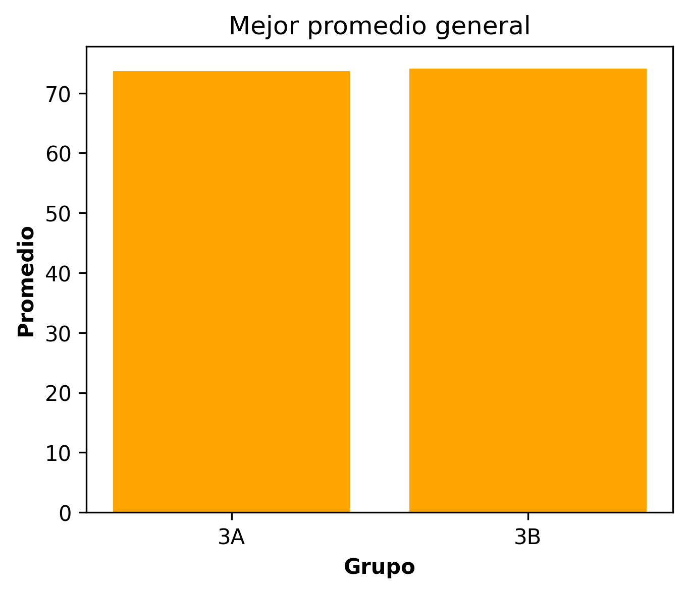
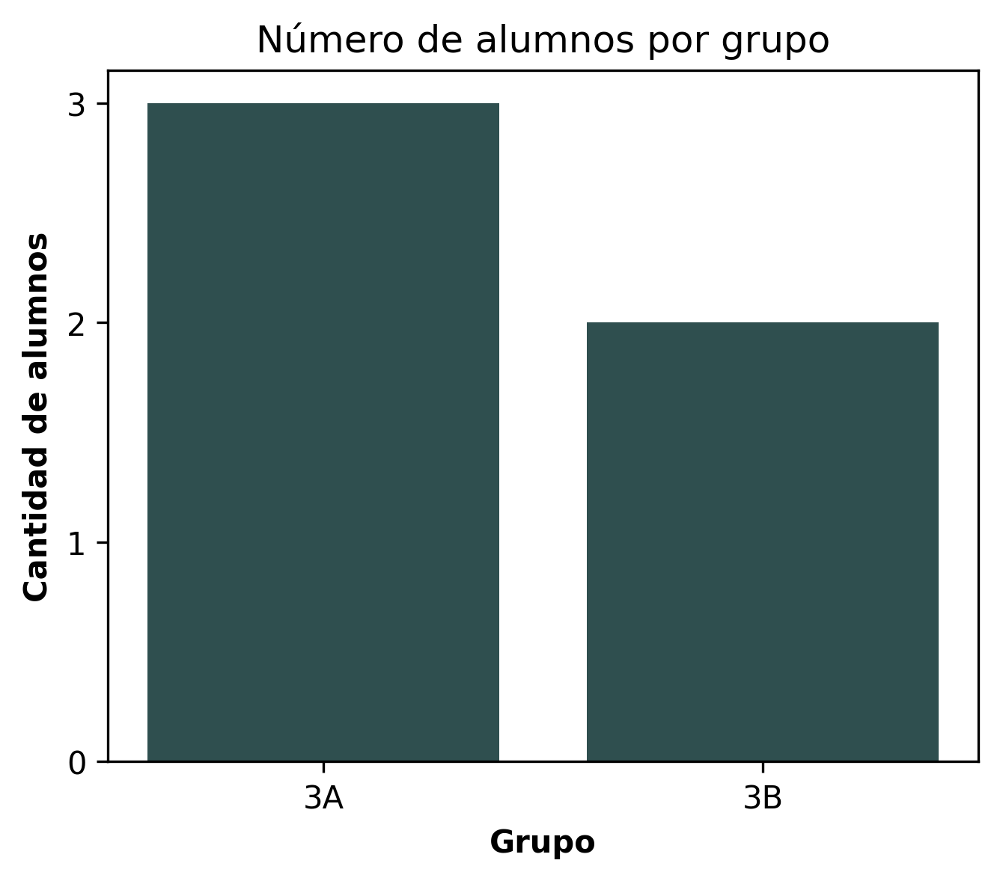
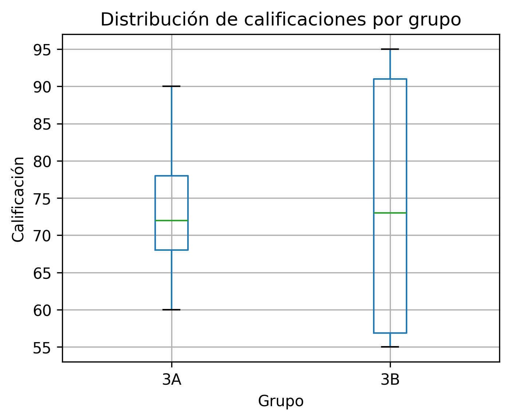
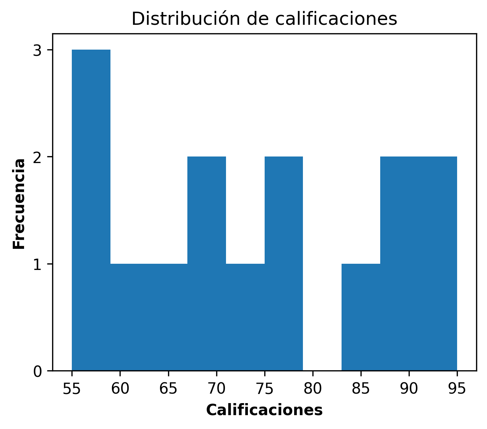
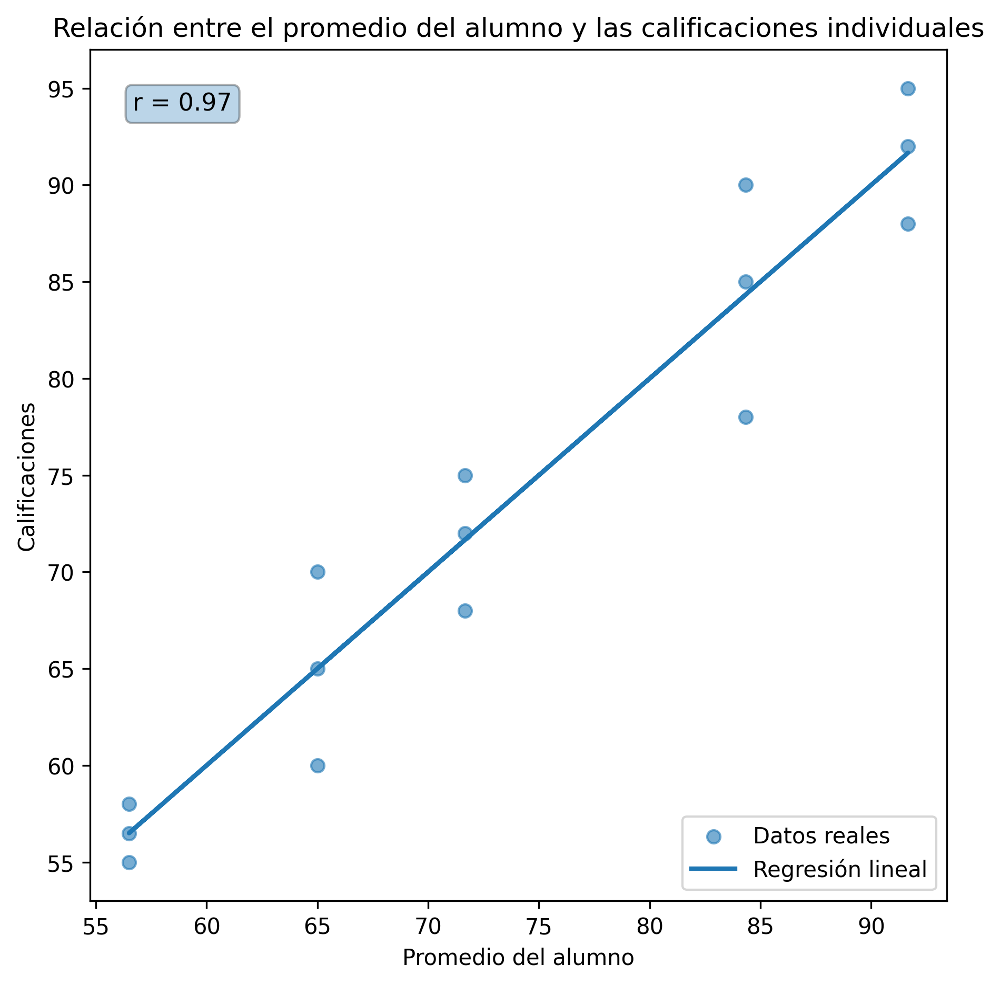

# ANÁLISIS DE DATOS: CALIFICACIONES DE ALUMNOS.

### Objetivo del análisis:

Analizar el desempeño académico de los alumnos mediante técnicas de análisis descriptivo (agregación y distribución) y análisis relacional, con el fin de identificar patrones, variabilidad y consistencia en las calificaciones, así como generar interpretaciones e implicaciones que apoyen la comprensión del rendimiento académico por grupo y materia.

### Descripción del dataset:

El conjunto de datos contiene información académica individual de los alumnos y está compuesto por las siguientes columnas:

- matricula: Identificador único del alumno

- nombre: Nombre del alumno

- materia: Asignatura cursada

- calificacion: Calificación obtenida en la materia

- grupo: Grupo académico al que pertenece el alumno

El dataset presenta valores faltantes en la columna calificacion, los cuales pueden afectar la consistencia del análisis y la interpretación de los resultados.
Para mitigar este problema, se aplicó un proceso de limpieza de datos mediante la imputación de valores faltantes, utilizando el promedio de calificaciones por alumno, con el fin de preservar la información disponible y mantener la coherencia del conjunto de datos.

### Metodología (limpieza y preparación):

Antes de la realización del análisis el dataset fue sometido a un proceso de limpieza de los datos vacíos, el cual constó de:

- Identificación de campos con valores nulos.

- Imputación de los campos faltantes mediante el promedio del alumno, basado en la idea de que la calificación del alumno es mérito del alumno, más allá de factores como la dificultad de la materia y el profesor.

- Verificación de la consistencia de los datos.

Esto permitió que los datos obtenidos fueran consistentes y comparables.

### Análisis relizados:

#### Análisis descriptivos por agregación: 

1. Observación - Se observa una variabilidad considerable en los promedios individuales, con alumnos concentrados en rangos altos y otros en rangos más bajos.

1. Interpretación - La variabilidad en los promedios individuales sugiere que el rendimiento no es homogeneo dentro del conjunto analizado.

1. Implicación - Este análisis proporciona una base objetiva para identificar el desempeño académico individual de los alumnos, lo que puede ser utilizado como insumo para el diseño de estrategias de seguimiento académico diferenciadas y la detección temprana de alumnos que requieran atención específica.

 

 

1. Observación - Los promedios por materia arrojan similitudes númericas entre sí, sin tener mucha variabilidad.

1. Interpretación - La baja variabilidad en los promedios por materia sugiere que el desempeño académico promedio se mantiene relativamente constante entre asignaturas, lo que podría indicar que, en términos generales, las materias presentan un nivel de exigencia similar o que los alumnos mantienen un rendimiento consistente independientemente de la asignatura cursada.

1. Implicación - El análisis de los promedios por materia permite identificar asignaturas que presentan desempeños relativamente más bajos o más altos, lo cual puede servir como referencia para evaluar áreas de oportunidad académica a nivel general dentro del conjunto de materias analizadas.

 

 

1. Observación - Los grupos presentan promedios generales similares, mostrando un comportamiento estable en términos de desempeño promedio.

1. Interpretación - La igualdad en los promedios generales indica que ambos grupos presentan un desempeño académico promedio similar, lo que sugiere que, a nivel grupal, no existe una ventaja clara de un grupo sobre otro en términos de rendimiento general.

1. Implicación - Este análisis proporciona un marco de referencia para comparar el rendimiento académico entre grupos, lo cual resulta útil para contextualizar diferencias o similitudes en el desempeño general del estudiantado.

 

 

1. Observación - La gráfica muestra una comparación entre la cantidad de alumnos que hay entre los dos grupos, haciendose notar que el grupo 3A tiene un alumno más que el grupo 3B.

1. Interpretación - Al existir una diferencia mínima en el número de alumnos entre los grupos, esta variable no representa un factor determinante que influya de forma relevante en los promedios o distribuciones de calificaciones observadas.

1. Implicación - Al contar con una matrícula equilibrada entre los grupos, los resultados obtenidos permiten realizar comparaciones cuantitativas más consistentes, reduciendo el sesgo asociado al tamaño de muestra.

 

 

#### Análisis descriptivo por distribución:

1. Observación - Se observan diferencias en la dispersión de las calificaciones entre los grupos, donde el grupo 3A presenta una distribución más concentrada y el grupo 3B una mayor dispersión.

1. Interpretación - El diagrama de caja muestra que el grupo B presenta una mayor dispersión en sus calificaciones, abarcando desde valores reprobatorios hasta calificaciones sobresalientes cercanas a 95. En contraste, el grupo A concentra sus calificaciones en un intervalo más acotado, aproximadamente entre 60 y 90, sin presencia de valores reprobatorios, lo que indica una distribución más homogénea.

1. Implicación - Este análisis permite identificar los rangos de calificación y la variabilidad del desempeño académico entre los distintos grupos, facilitando la detección de grupos con mayor dispersión y la presencia de calificaciones bajas. Esta información resulta útil para priorizar la atención académica y enfocar estrategias de seguimiento en aquellos grupos o alumnos que presentan desempeños críticos.

 

 

1. Observación - La distribución de las calificaciones muestra una dispersión amplia a lo largo de distintos rangos, sin una concentración uniforme en un solo intervalo.

1. Interpretación - La distribución de las calificaciones presenta una alta dispersión, lo que indica que los alumnos no mantienen un desempeño homogéneo. Se observa una mayor concentración de calificaciones en el intervalo aproximado de 55 a 60, mientras que existen intervalos, como el comprendido entre 77 y 84, en los que no se registran observaciones, evidenciando una distribución irregular.

1. Implicación - La identificación de una dispersión crítica en las calificaciones permite reconocer la existencia de rangos de desempeño heterogéneos entre los alumnos, así como la concentración de calificaciones en niveles bajos. Esta información resulta clave para orientar procesos de evaluación académica y apoyar la detección de estudiantes que requieren seguimiento especial.

 

 

#### Análisis relacional:

1. Observación - Por último analizamos la relación entre el promedio de los alumnos y sus calificaciones, apreciando la dispersión de estos datos, así como la regresión líneal, la cuál nos indica en promedio en qué punto de la gráfica se encuentran los datos, se observa una relación positiva entre el promedio del alumno y sus calificaciones individuales, evidenciada por una tendencia ascendente en la línea de regresión.

1. Interpretación - La gráfica de dispersión muestra una relación positiva entre el promedio general del alumno y sus calificaciones individuales, lo que indica que los alumnos con promedios más altos tienden a concentrar calificaciones mayores en sus materias. La nube de puntos presenta una dispersión moderada alrededor de la tendencia lineal, lo que sugiere una consistencia razonable en el desempeño académico de los alumnos, con algunas variaciones individuales.
Esta relación positiva es consistente con el coeficiente de correlación obtenido, el cual refuerza la existencia de una asociación lineal entre ambas variables.

1. Implicación - La relación positiva entre el promedio del alumno y sus calificaciones individuales permite utilizar el promedio como un indicador general del desempeño académico, facilitando el análisis del comportamiento del alumno sin necesidad de evaluar cada calificación de forma aislada.

 

 

### Conclusiones:

El análisis realizado permitió examinar el comportamiento de las calificaciones desde distintas perspectivas estadísticas, incluyendo análisis por agregación, distribución y relación entre variables.

A través de estos enfoques fue posible comparar el desempeño académico entre alumnos, materias y grupos, así como identificar variaciones en la distribución de las calificaciones y patrones de comportamiento relevantes dentro del conjunto de datos.

Estos resultados proporcionan una base objetiva para evaluar el desempeño académico y detectar áreas de oportunidad tanto a nivel individual como grupal.

### Tecnologías utilizadas:

- Python.
- Numpy.
- Pandas.
- Matplotlib.
- Excel.

## Created by Andrés Mendoza.

